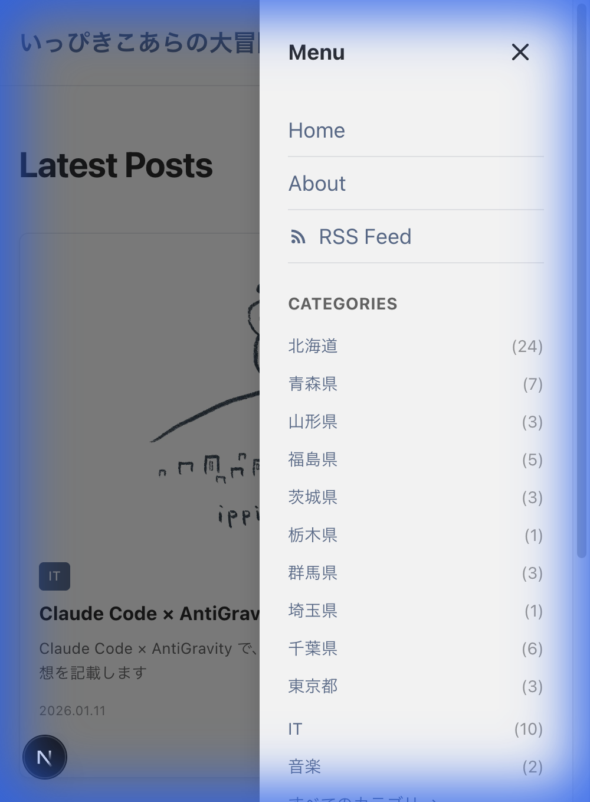
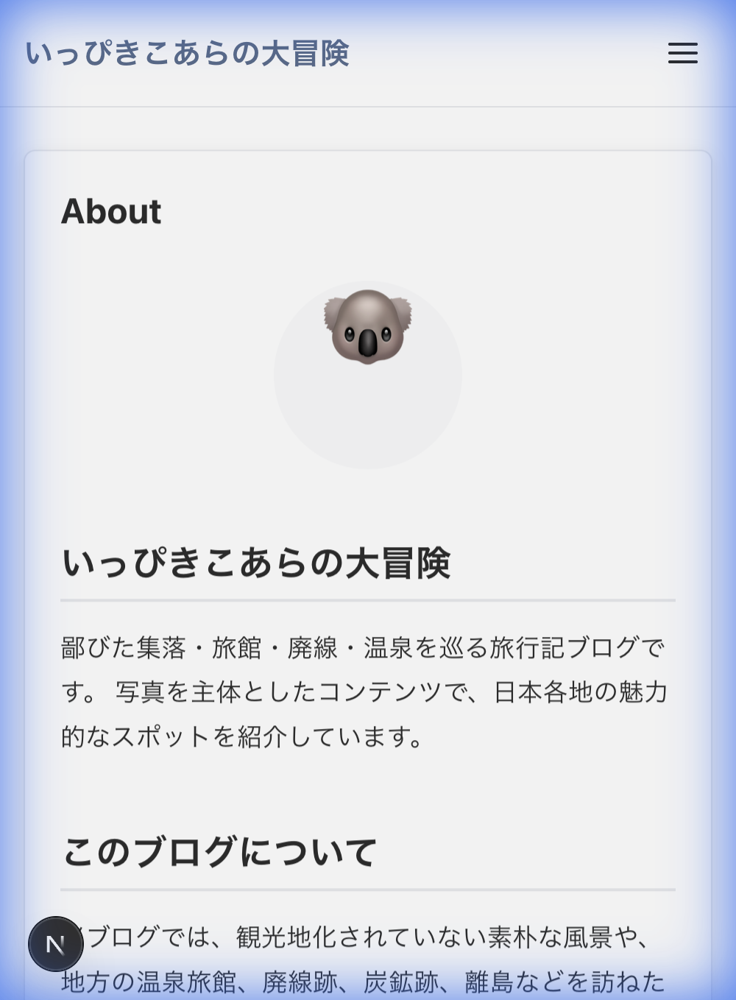
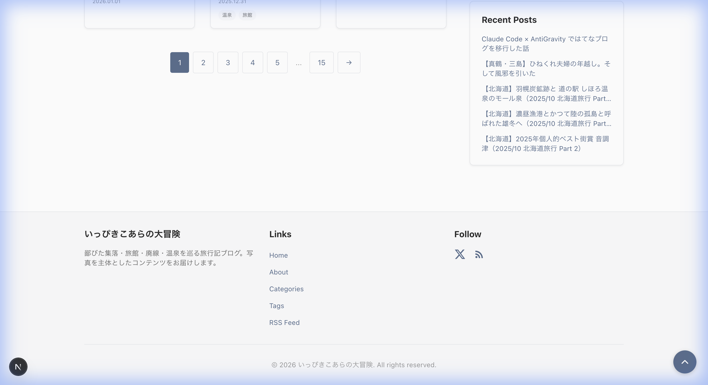
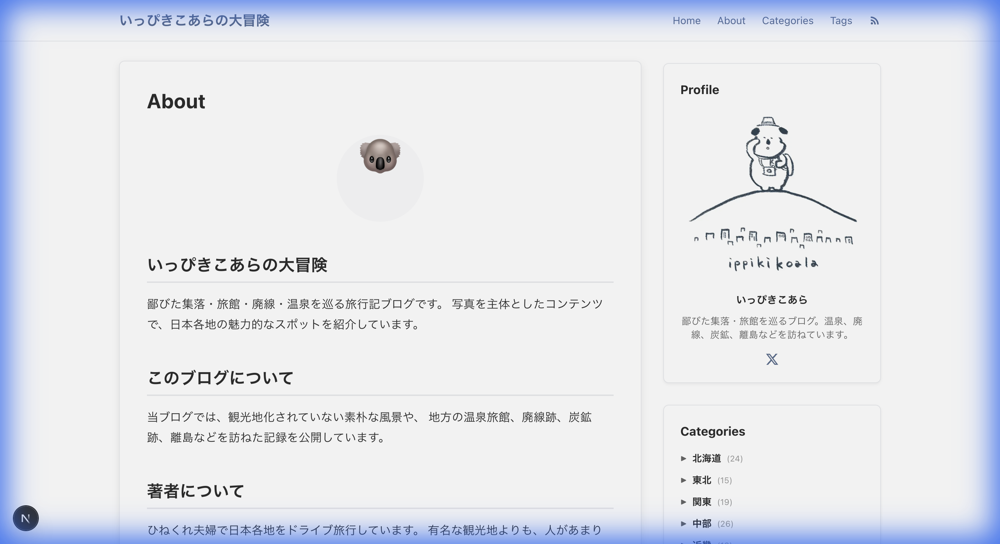
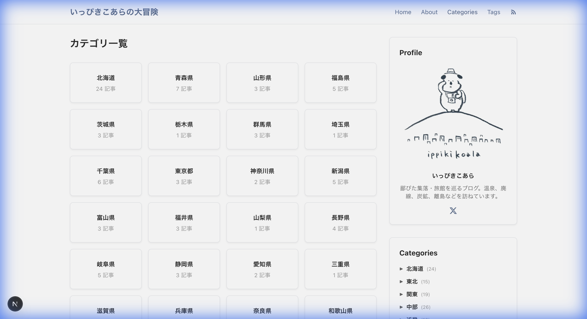
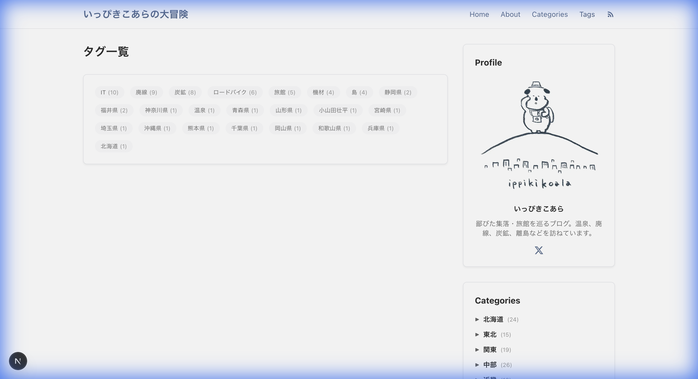
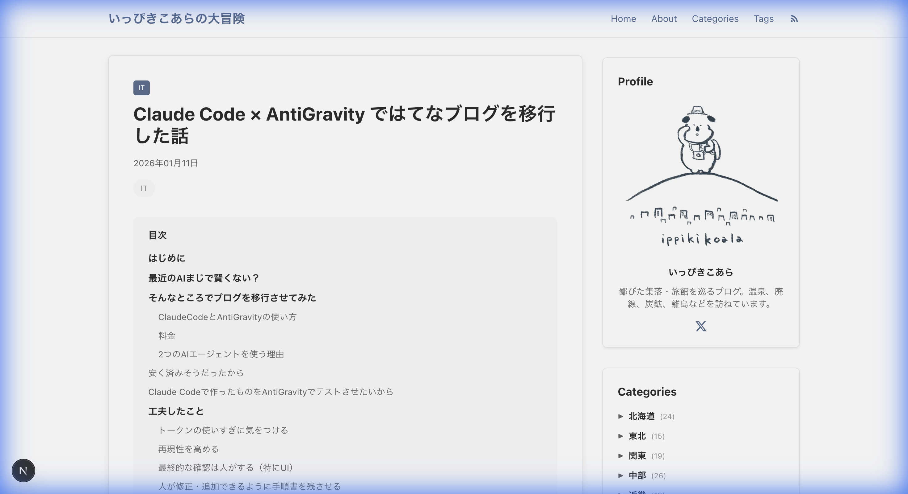
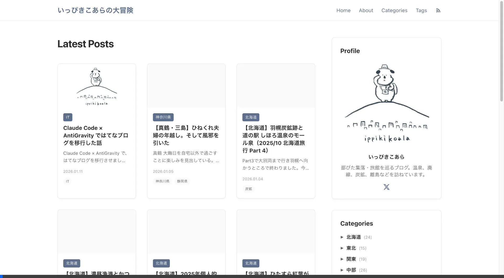
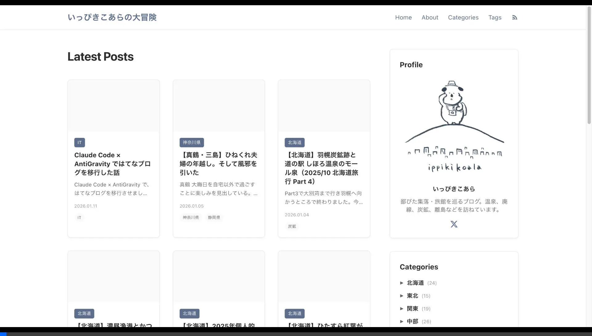

# ブログテストレポート

**検査日時**: 2026-01-12 14:08  
**検査対象**: http://localhost:3000 (開発サーバー)  
**前回テスト**: 2026-01-12 13:57

---

## 📊 テスト結果サマリー

| カテゴリ | ステータス | 詳細 |
|---------|-----------|------|
| ページ読み込み | ✅ 正常 | 全ページが正常に読み込まれる |
| ナビゲーション | ✅ 正常 | ヘッダーナビゲーションが機能 |
| カテゴリ機能 | ✅ 正常 | カテゴリページが正常に表示 |
| タグ機能 | ✅ 正常 | タグページが正常に表示 |
| 記事ページ | ✅ 正常 | 記事、目次が正常に表示 |
| モバイルレスポンシブ | ✅ 正常 | レイアウトがモバイル対応 |
| モバイルメニュー | ✅ 正常 | **修正完了** - リサイズ・ページ遷移時の問題が解決 |

---

## 🎯 今回の修正内容

### ✅ Issue #3: モバイルメニューがリサイズ後に残る（修正完了）

**問題の詳細**:
モバイルサイズ（375px）でハンバーガーメニューを開いた後、ブラウザをデスクトップサイズ（1280px）にリサイズすると、モバイルメニューのオーバーレイが画面に残り続けていた。

**修正内容**:
[`src/components/MobileMenu.tsx`](file:///Users/ippiki_koala/Desktop/Claude/blog/src/components/MobileMenu.tsx) に以下のコードを追加:

```typescript
// Close menu when resizing to desktop size
useEffect(() => {
  const handleResize = () => {
    // デスクトップサイズ（768px以上）になったらメニューを閉じる
    if (window.innerWidth >= 768) {
      setIsMenuOpen(false);
    }
  };

  window.addEventListener('resize', handleResize);
  return () => window.removeEventListener('resize', handleResize);
}, []);
```

**確認結果**: ✅ PASS - デスクトップサイズにリサイズ後、メニューが自動的に閉じることを確認

---

### ✅ Issue #4: モバイルメニューがページ遷移後も閉じない（修正完了）

**問題の詳細**:
モバイルメニュー内のリンクをクリックしてページ遷移した後も、モバイルメニューが自動的に閉じられなかった。

**修正内容**:
[`src/components/MobileMenu.tsx`](file:///Users/ippiki_koala/Desktop/Claude/blog/src/components/MobileMenu.tsx) に `usePathname` フックを追加し、パス変更時にメニューを閉じるようにした:

```typescript
import { usePathname } from "next/navigation";

// コンポーネント内
const pathname = usePathname();

// Close menu when pathname changes (page navigation)
useEffect(() => {
  setIsMenuOpen(false);
}, [pathname]);
```

**確認結果**: ✅ PASS - ページ遷移後、メニューが自動的に閉じることを確認

---

## 🎯 テスト詳細

### ✅ ナビゲーションテスト

| テスト項目 | ステータス | 備考 |
|-----------|-----------|------|
| ホームページ読み込み | ✅ PASS | ヘッダー、記事リスト、サイドバー、フッターが正常表示 |
| About ページ | ✅ PASS | プロフィール画像、ブログ説明が正常表示 |
| Categories ページ | ✅ PASS | カテゴリカードのグリッドが正常表示 |
| Tags ページ | ✅ PASS | タグボタンと件数が正常表示 |
| 記事詳細ページ | ✅ PASS | タイトル、本文、目次が正常表示 |

### ✅ モバイルレスポンシブテスト

| テスト項目 | ステータス | 備考 |
|-----------|-----------|------|
| モバイル表示（375px） | ✅ PASS | レイアウトが正常に適応 |
| ハンバーガーメニュー開閉 | ✅ PASS | メニューが正常に開く |
| モバイルメニューからナビゲーション | ✅ PASS | **修正済み** - ページ遷移後にメニューが自動的に閉じる |
| リサイズ時のメニュー挙動 | ✅ PASS | **修正済み** - デスクトップサイズにリサイズ後にメニューが閉じる |

---

## ✅ 正常に動作している機能

以下の機能は正常に動作していることを確認しました:

### ページ読み込み
- ✅ ホームページ
- ✅ カテゴリ一覧ページ
- ✅ タグ一覧ページ
- ✅ 個別記事ページ
- ✅ Aboutページ

### ナビゲーション
- ✅ ヘッダーナビゲーション（Home, About, Categories, Tags）
- ✅ RSSフィードリンク
- ✅ カテゴリリンク（全て正常）
- ✅ タグリンク

### レイアウト
- ✅ レスポンシブデザイン（モバイル・デスクトップ）
- ✅ サイドバー表示（Profile, Categories, Tags, Recent Posts）
- ✅ 記事カードグリッドレイアウト
- ✅ 目次（Table of Contents）

### モバイル機能
- ✅ ハンバーガーメニューの開閉
- ✅ モバイルメニューのナビゲーション表示
- ✅ ページ遷移時のメニュー自動クローズ（**修正済み**）
- ✅ リサイズ時のメニュー自動クローズ（**修正済み**）

---

## 📸 テスト時のスクリーンショット

### 修正確認スクリーンショット






### 前回テストからのスクリーンショット（参考）











---

## 🎬 テスト動画

テスト中のブラウザ操作は以下の動画に記録されています:

**修正確認テスト**:


**前回テスト動画（参考）**:




---

## 📋 問題一覧と優先度

| # | 問題 | 重要度 | ステータス | 前回からの変更 |
|---|------|--------|-----------|---------------|
| 3 | モバイルメニューがリサイズ後に残る | 🟡 中 | ✅ 修正完了 | 修正済み |
| 4 | モバイルメニューがページ遷移後も閉じない | 🟡 中 | ✅ 修正完了 | 修正済み |

---

## � 前回テストとの比較

### 修正された問題
- ✅ モバイルメニューのリサイズ問題（Issue #3）- **修正完了**
- ✅ モバイルメニューのページ遷移後の自動クローズ問題（Issue #4）- **修正完了**

### 改善された点
- `MobileMenu.tsx` にリサイズイベントリスナーを追加
- `usePathname` フックを使用してページ遷移を検知し、メニューを自動クローズ

---

## 💡 総評

**全体的な評価**: � 優良

前回のテストで報告された2つの問題（Issue #3、Issue #4）がすべて修正されました。サイトの基本機能およびモバイルメニューの動作は全て正常に動作しています。

**完了したアクション**:
1. ✅ Issue #3の修正: モバイルメニューのリサイズ対応
2. ✅ Issue #4の修正: ページ遷移時のメニュー自動クローズ
3. ✅ 再テスト実施および確認

**推奨される次のステップ**:
1. 本番環境へのデプロイ
2. 本番環境での最終確認

---

**レポート作成日**: 2026-01-12 14:08 JST  
**テスト実施者**: AI Assistant
